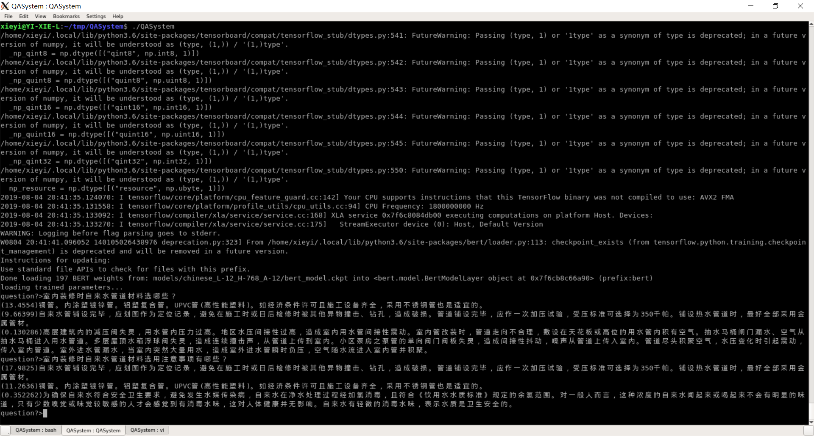

# QASystem
this is a QASystem implemented with BERT

# install prerequisite packages

install with command

```bash
pip3 install -U tf-nightly-2.0-preview bert-for-tf2
sudo apt install libboost-all-dev
```

# download pretrained bert model for Chinese language

download with the following command.
```bash
bash downloads.sh
```

# collect question and answer pairs

put the questions and answers in format as question_answer.txt's. and execute following command to convert the collected samples into dataset format.

```bash
make
./create_dataset -i question_answer.txt -o dataset
```

# finetune bert classifer to predict relavance between question and answer correctly

with directory dataset generated by the above command presented, finetune with the following to start finetune.
```bash
python3 Predictor.py
```

# create term frequency and document frequency database

generate the database with command
```bash
./create_database
```

the generated database is save in file database.dat.

# test the QASystem

run the QA system by
```bash
./QASystem
```
quit the QA system by enter quit.




